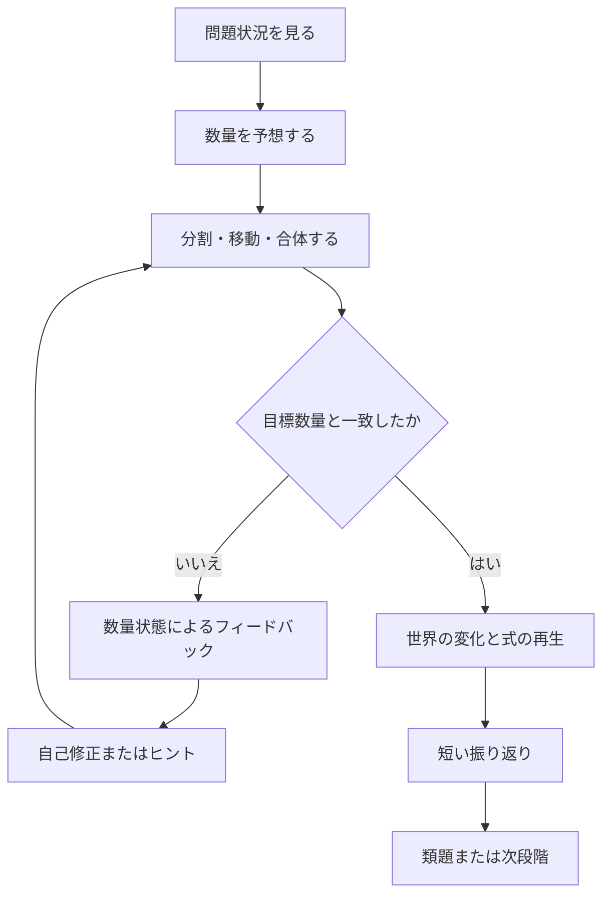
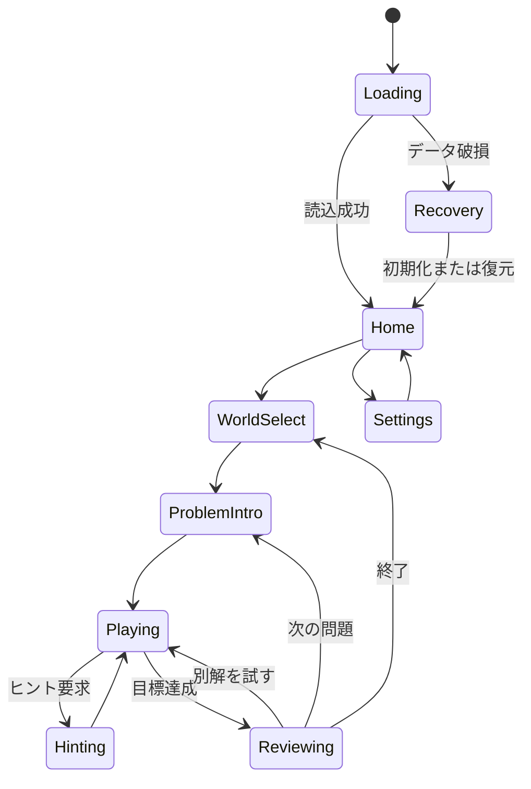

# 1. 文書の目的

本書は、足し算・引き算を視覚操作によって学ぶ教育ゲーム「10の港（仮称）」のMVP仕様を定義する。

対象読者は、プロダクトオーナー、ゲームデザイナー、UI/UXデザイナー、エンジニア、教材設計者、QA担当者である。本書だけを読めば、少なくともMVPの画面設計、問題データ作成、実装、テスト、受け入れ判定を開始できる状態を目標とする。

本書では、次を区別する。

- **要求**：実装時に満たすべき条件
- **推奨**：合理的な理由があるが、実装制約に応じて変更可能な条件
- **検証仮説**：ユーザーテストで妥当性を確認する設計判断

「必須」「〜しなければならない」は要求を表す。「推奨」「望ましい」は推奨事項を表す。

---

# 2. プロダクト概要

## 2.1 コンセプト

> 足し算・引き算に正解すると遊べるゲームではなく、数を足す・引く・分ける・まとめる行為そのものが遊びになるゲーム。

プレイヤーは、エネルギー粒、荷物、橋の部品などの数量オブジェクトを操作し、目的地が要求する数を作る。数量オブジェクトの合体、分割、移動、交換が、そのまま加法・減法・数の分解・10のまとまりの理解に対応する。

## 2.2 MVPの対象範囲

MVPは、**20以内の足し算、とくに「10を作る」方略**に限定する。

例：

```text
8 + 7
= 8 + 2 + 5
= 10 + 5
= 15
```

引き算、数直線、位取りブロック、文章題は将来拡張とし、MVPでは本実装しない。ただし、データ構造と画面構成は将来追加を妨げないものとする。

## 2.3 想定利用場面

- 小学校1年後半〜2年初期の個人学習
- 家庭での短時間学習
- 教室内での補助教材
- 数と量の対応、10の補数、繰り上がり加法につまずきがある学習者への支援

## 2.4 対象ユーザー

### 主対象

- おおむね6〜8歳
- 1〜10の数唱ができる
- 数字と数量の対応を学習中、または習得済み
- マウス、タッチ、キーボードのいずれかで基本操作ができる

### 副対象

- 保護者
- 教員・支援者
- 読字、色覚、微細運動、注意持続に配慮が必要な学習者

---

# 3. 目標と非目標

## 3.1 学習目標

MVP終了時、プレイヤーが次を行える状態を目標とする。

1. 10フレーム上の数量を、一つずつ数えずに5や10のまとまりとして捉える。
2. 10までの不足数を判断する。
3. 一方の加数を分解し、もう一方へ移して10を作る。
4. 自分が行った視覚操作と式を対応づける。
5. 見た目や配置が変わっても、同じ方略を類題へ適用する。

## 3.2 ゲーム体験上の目標

- 操作した結果が、ゲーム世界の変化として即時に返る。
- 間違いを人格評価ではなく、修正可能な数量状態として提示する。
- 速さよりも発見、理解、自己修正を優先する。
- 同じ問題に複数の操作経路がある場合、数学的に妥当な別解を許容する。

## 3.3 MVPの非目標

以下はMVPの対象外とする。

- 20を超える計算
- 引き算の体系的学習
- 筆算
- 数直線、位取りブロック、テープ図の本実装
- 対人対戦
- 公開ランキング
- チャット、フレンド、SNS共有
- ガチャ、広告、課金
- 教員向けクラウド管理画面
- 外部分析SDKによる行動追跡
- 生成AIによる問題自動生成
- 正答速度のみを目的とした訓練

---

# 4. 用語定義

| 用語 | 定義 |
|---|---|
| 数量オブジェクト | 1個の量を表す、移動可能な粒・荷物・ブロック |
| 10フレーム | 2行×5列、合計10マスの数量表示枠 |
| 加数 | 足し算で足される各数 |
| 10の補数 | ある数と合わせて10になる数。例：8に対する2 |
| 分割 | 一つの数量グループを二つ以上へ分ける操作 |
| 合体 | 複数の数量グループを一つへまとめる操作 |
| 自力正解 | ヒントを使用せず、正しい数量状態へ到達すること |
| 類題 | 数、配置、物語表現の一部は異なるが、同じ方略で解ける問題 |
| 表現フェード | 具体物→整理された図→式へ、視覚補助を段階的に減らすこと |
| セッション | アプリ起動から終了、または学習中断までの一連の利用 |

---

# 5. 設計原則

## 5.1 数学操作をゲーム操作にする

プレイヤーは、四択から答えを選ぶのではなく、数量オブジェクトを直接操作して答えを作る。

必須条件：

- 正しい答えを知らなくても総当たりだけで突破できない。
- 数学的に意味のある操作が、クリアに必要である。
- 問題を解いた後に無関係なゲームを遊ばせる構造を主ループにしない。

## 5.2 操作の後に式を見せる

導入段階では、式を先に解かせるのではなく、プレイヤーの操作を式へ変換して表示する。

例：

```text
[8個の枠] + [7個のグループ]
          ↓ 7を2と5に分割
[10個の枠] + [5個のグループ]
          ↓
8 + 7 = 10 + 5 = 15
```

後半では式を先に表示し、必要なときだけ視覚補助を開ける。

## 5.3 間違いを数量状態として返す

禁止例：

```text
不正解！
×
もっと頑張ろう
```

推奨例：

```text
15個必要です。現在は14個あります。
あと1個で届きます。
```

## 5.4 速度と理解を分離する

学習モードではタイマーを使用しない。回答時間は内部計測してもよいが、プレイヤーへ競争的に提示しない。

将来追加する流暢性モードは、概念習得済みの内容に限定し、学習モードとは成績を分ける。

## 5.5 支援は減らせるが、いつでも呼び戻せる

視覚補助は習熟に応じて減らす。ただし、補助を使うこと自体を失敗として扱わない。プレイヤーは任意に10フレームを再表示できる。

---

# 6. コアループ

## 6.1 基本フロー



## 6.2 1問の標準進行

1. 目的地と必要数を提示する。
2. 二つの数量グループを提示する。
3. プレイヤーが数量を分割、移動、合体する。
4. 目標数量に達すると、装置・橋・船などが作動する。
5. 操作履歴を式のアニメーションへ変換する。
6. 必要に応じて「別の作り方」を試せる。
7. 次の類題へ進む。

## 6.3 1問の想定時間

- 導入問題：30〜90秒
- 習熟問題：15〜45秒
- 上限時間は設定しない。
- 90秒以上停滞した場合、任意ヒントを目立たせる。ただし自動で答えを確定しない。

---

# 7. 世界観と演出

## 7.1 テーマ

仮テーマは「島へエネルギーを届け、港や灯台を動かす」とする。

数量オブジェクトは「エネルギー粒」とし、10個集まると一つの安定したエネルギーセルになる。数学的構造を隠さないため、粒の形状と配置は常に判別可能でなければならない。

## 7.2 演出原則

- 正解演出は2秒以内を基本とする。
- 紙吹雪や画面揺れは設定で軽減・停止できる。
- 数量を数える効果音と装飾音を分離する。
- 演出中も式と数量の対応が視認できる。
- キャラクターや背景が10フレームを覆わない。

## 7.3 報酬

MVPでは次を採用する。

- ステージの環境変化
- 新しい島・装置の解放
- 発見した数の分け方を記録する「数の図鑑」
- ヒントなし達成、別解発見などの非競争的バッジ

採用しないもの：

- 公開順位
- 連続ログイン報酬
- ランダム抽選
- 外部広告視聴によるヒント獲得
- 学習を中断させる報酬画面

---

# 8. 数学メカニクス

## 8.1 数量オブジェクト

各オブジェクトは1を表す。視覚上の大きさは一定とし、装飾によって1個の境界が曖昧になってはならない。

要求：

- 選択状態が色以外でも判別できる。
- ドラッグ中の個数が表示される。
- グループ全体と、グループ内の一部のどちらも選択できる。
- 誤操作は1手単位で取り消せる。

## 8.2 10フレーム

- 2行×5列で固定する。
- 原則として左上から右方向、次に下段へ自動整列する。
- 空きマスは明確に視認できる。
- 5個の境界が分かるように、中央区切りを形状または間隔で示す。
- 色のみで上段・下段、空き・使用中を区別しない。

## 8.3 分割

プレイヤーは、加数のグループを任意の位置で二分できる。

例：7を2と5へ分ける。

操作候補：

1. グループをタップして分割ハンドルを表示する。
2. ハンドルを2の位置へ移動する。
3. 「2」と「5」の数量ラベルを表示する。

代替操作：

- キーボード利用時は左右キーで分割位置を選び、Enterで確定する。
- スイッチ操作利用時は候補を順番に走査する。

## 8.4 移動

分割したグループを10フレームの空きへ移す。

- 空き数と一致するグループを近づけると、配置候補を示す。
- 一致しないグループを置いた場合、置ける分だけ自動で切り取ってはならない。
- 一致しない場合は元位置へ戻し、「空きは2、選んだ数は3」のように差を示す。

## 8.5 合体

10フレームが満たされた後、残ったグループと合わせて合計を表示する。

- 合体時に個数ラベルを更新する。
- 合体アニメーションと式の変形を同期する。
- 10を作らない別解も数学的に正しければ許容できる設計を推奨する。ただしMVPの学習目標上、最終振り返りでは10を作る方法も示す。

## 8.6 操作履歴

1問ごとに次を記録する。

- 初期状態
- 分割位置
- 移動元・移動先
- 取り消し回数
- ヒント段階
- 完了時の数量構造

操作履歴は式アニメーションの生成と、ローカル学習記録に使用する。

---

# 9. 表現フェード

## 9.1 段階

| 段階 | 主表示 | 式 | 補助 |
|---|---|---|---|
| R1 | 具体的なエネルギー粒 | 完了後のみ | 常時10フレーム |
| R2 | 単純化した点・ブロック | 操作に追従 | 常時10フレーム |
| R3 | 10フレームと数ラベル | 常時表示 | 分割候補あり |
| R4 | 式を先に表示 | 常時表示 | 10フレームを任意表示 |
| R5 | 式主体 | 常時表示 | 必要時のみ呼び出し |

## 9.2 段階移行規則

初期実装では、説明可能なルールベースを使用する。

```text
同じ方略群で2問連続の自力正解
    → 補助を1段階減らす

同じ段階で2回連続して誤った数量を確定
    → 補助を1段階戻す

ヒント段階3以上を使用して正解
    → 同じ表現段階の類題を出す

補助を自分で再表示して正解
    → 正解として扱うが、自力正解とは分けて記録する
```

段階移行は問題の数値難度とは別に管理する。

---

# 10. ヒントシステム

## 10.1 原則

- ヒントは答えではなく、次に見るべき関係を示す。
- ヒント使用を罰しない。
- 同じヒントを繰り返すのではなく、段階的に具体化する。
- 最終実演後は、数値または配置を変えた類題を必ず1問提示する。

## 10.2 ヒント段階

| 段階 | 内容 | 例 |
|---|---|---|
| H0 | 自然な結果のみ | 橋が1マス足りず届かない |
| H1 | 注意を向ける | 10フレームの空きマスを短く強調 |
| H2 | 関係を言語化 | 「8には、あといくつで10？」 |
| H3 | 分割候補を示す | 7の2個目の位置に分割マーカー |
| H4 | 一部を実演 | 7を2と5へ分けるところまで再生 |
| H5 | 全体を実演 | 2を移して10を作り、5を残す流れを再生 |

## 10.3 ヒント起動条件

次のいずれかでヒントボタンを目立たせる。

- 12秒以上入力がない。
- 同じ不成立操作を2回行った。
- 取り消しを3回以上連続して使用した。

自動表示はH1までとし、H2以降はプレイヤーまたは支援者の操作で進める。

---

# 11. 問題構成

## 11.1 MVP問題数

全24問を手作業で設計する。完全ランダム生成はMVPでは行わない。

## 11.2 問題群

| 群 | 問題番号 | 目的 | 表現 |
|---|---:|---|---|
| A | 1〜4 | 5〜8までの合成を操作で確認 | R1 |
| B | 5〜8 | 10の補数を発見 | R1〜R2 |
| C | 9〜12 | 10を作る基本 | R2 |
| D | 13〜16 | より大きい繰り上がり | R2〜R3 |
| E | 17〜20 | 加数の順序・配置が変わっても適用 | R3〜R4 |
| F | 21〜24 | 式主体で方略を呼び出す | R4〜R5 |

## 11.3 推奨問題セット

```yaml
A:
  - 3 + 2
  - 4 + 1
  - 2 + 4
  - 5 + 3
B:
  - 9 + 1
  - 8 + 2
  - 7 + 3
  - 6 + 4
C:
  - 9 + 2
  - 8 + 3
  - 7 + 4
  - 6 + 5
D:
  - 9 + 5
  - 8 + 6
  - 7 + 7
  - 6 + 8
E:
  - 2 + 9
  - 3 + 8
  - 4 + 7
  - 5 + 6
F:
  - 8 + 7
  - 9 + 6
  - 7 + 5
  - 6 + 9
```

## 11.4 問題データ形式

```json
{
  "id": "C-03",
  "operation": "addition",
  "a": 7,
  "b": 4,
  "target": 11,
  "strategyTag": "make-ten",
  "representation": "R2",
  "storyTheme": "lighthouse-energy",
  "preferredSplit": [3, 1],
  "allowedSplits": [[1, 3], [2, 2], [3, 1]],
  "showEquationAtStart": false,
  "allowVisualRecall": true,
  "hintScript": ["H1", "H2", "H3", "H4", "H5"]
}
```

`preferredSplit`は指導上示したい分け方であり、それ以外の数学的に正しい分割を即座に不正解としてはならない。

---

# 12. 画面仕様

## 12.1 画面一覧

| ID | 画面 | 目的 |
|---|---|---|
| S-001 | 起動画面 | ローカルデータ読込、設定反映 |
| S-002 | ホーム | 続きから、最初から、自由練習、設定 |
| S-003 | ワールド選択 | 解放済み問題群の選択 |
| S-004 | 問題画面 | 中核操作 |
| S-005 | 振り返り | 操作と式の対応、別解確認 |
| S-006 | 数の図鑑 | 発見した分解・合成の閲覧 |
| S-007 | 設定 | 音、動き、文字、操作方式、データ削除 |
| S-008 | 保護者・支援者画面 | ローカル進捗、設定、データ管理 |

## 12.2 問題画面ワイヤーフレーム

```text
┌──────────────────────────────────┐
│ [戻る]   島 3-2        [音] [設定] │
├──────────────────────────────────┤
│  灯台を動かすには 15こ必要          │
│                                    │
│       ┌──────────────┐             │
│       │   灯台・目的地   │             │
│       └──────────────┘             │
│                                    │
│  10フレーム             手元の数     │
│  [●●●●●]              [●●●●●●●]  │
│  [●●●□□]                            │
│                                    │
├──────────────────────────────────┤
│  式：8 + 7                         │
│  [元に戻す] [やり直す] [ヒント] [決定] │
└──────────────────────────────────┘
```

## 12.3 レイアウト要求

- タブレット横向きを基準とする。
- 画面幅が狭い場合は縦配置へ切り替える。
- 中核操作領域は画面の50%以上を確保する。
- 主要タッチ対象は48dp相当以上とする。
- タッチ対象間に誤操作を避ける間隔を設ける。
- 問題文は原則2行以内とし、音声再生を用意する。

## 12.4 操作方式

必須：

- タッチ
- マウス
- キーボード

推奨：

- スイッチアクセスを想定したフォーカス順
- スクリーンリーダー向けの数量ラベル

キーボード例：

| キー | 動作 |
|---|---|
| Tab / Shift+Tab | 操作対象移動 |
| 矢印 | 数量選択、分割位置、移動先の変更 |
| Enter / Space | 選択・確定 |
| Esc | キャンセル |
| Ctrl/Cmd + Z | 元に戻す |
| H | ヒント |

---

# 13. 状態遷移



## 13.1 問題内状態

| 状態 | 説明 | 許可操作 |
|---|---|---|
| INTRO | 状況提示中 | 読み上げ、スキップ |
| READY | 初期状態 | 選択、分割、移動、ヒント |
| DRAGGING | 移動中 | ドロップ、キャンセル |
| INVALID | 不成立結果表示 | 戻す、ヒント、再操作 |
| SOLVED | 数量目標達成 | 振り返りへ進む |
| REVIEW | 式変形表示 | 再生、一時停止、別解、次へ |

---

# 14. フィードバック仕様

## 14.1 正しい途中操作

- 対象が吸着する。
- 数量ラベルを更新する。
- 控えめな肯定音を鳴らす。
- 「10のまとまりができました」のように数学的事実を表示する。

## 14.2 不成立操作

- オブジェクトを元の位置へ戻す。
- 失敗音は短く、威圧的にしない。
- 理由を数量関係で示す。

例：

```text
空いているのは2マスです。
選んだのは3こです。
```

## 14.3 正解

- 世界の因果変化を再生する。
- 「せいかい」だけで終わらず、成立した数量関係を示す。
- 式変形を操作履歴に合わせて表示する。

例：

```text
7を2と5に分けました。
8と2で10になりました。
10と5で15です。
8 + 7 = 15
```

## 14.4 別解

同じ合計へ別の分割で到達した場合：

- 数学的に正しければクリアとする。
- 「別の作り方を見つけました」と表示する。
- 10を作る方略を未使用の場合、振り返りで比較提示する。
- 「あなたの方法」と「10を作る方法」を優劣ではなく並列に表示する。

---

# 15. 進捗・評価

## 15.1 プレイヤー向け表示

プレイヤーには次を表示できる。

- 完了した島
- 発見した分け方
- 視覚補助あり／なしで解けた問題数
- 次に学ぶ内容

表示しないもの：

- 他者順位
- 偏差値
- 「苦手児」などのラベル
- 失敗回数を強調する累積表示

## 15.2 支援者向け表示

端末内のみで次を表示する。

- 問題ごとの試行数
- ヒント使用段階
- 自力正解か補助付き正解か
- 主に使った方略
- 視覚補助を外したときの成績
- 誤操作率

## 15.3 学習指標

MVP検証時に測る。

- 10の補数の正答率
- 10を作る方略の自発使用率
- 未出題類題の正答率
- 視覚補助なしの正答率
- 数え上げから、まとまり利用への変化
- 操作内容を言葉または式で説明できる割合

## 15.4 UX指標

- 初回問題を説明なしで開始できた割合
- ドラッグ失敗率
- 誤タップ率
- 1問あたりの取り消し回数
- ヒント前の停滞時間
- ヒント後に自力で完了できた割合
- 自主終了とエラー終了の区別

数値目標はパイロット前の仮値とし、最初のユーザーテスト後に再設定する。

---

# 16. データ仕様

## 16.1 保存方針

- 初期版は端末内保存のみとする。
- 本名、メールアドレス、位置情報、広告IDを取得しない。
- アカウント登録を要求しない。
- データ削除を設定画面から実行できる。
- クラウド同期はMVP対象外とする。

## 16.2 プレイヤープロファイル

```json
{
  "profileId": "local-uuid",
  "displayName": "プレイヤー1",
  "createdAt": "2026-07-20T00:00:00Z",
  "currentRepresentation": "R1",
  "settings": {
    "music": true,
    "soundEffects": true,
    "voice": true,
    "reducedMotion": false,
    "largeText": false,
    "highContrast": false,
    "inputMode": "auto"
  }
}
```

`displayName`は端末内の識別名であり、自由入力を必須にしない。既定値を使用できる。

## 16.3 試行記録

```json
{
  "attemptId": "uuid",
  "problemId": "C-03",
  "startedAt": "2026-07-20T00:10:00Z",
  "completedAt": "2026-07-20T00:10:44Z",
  "result": "solved",
  "independent": true,
  "hintLevel": 0,
  "representation": "R2",
  "splits": [[3, 1]],
  "undoCount": 1,
  "invalidMoveCount": 0,
  "visualAidReopened": false,
  "strategyDetected": "make-ten"
}
```

## 16.4 保存イベント

- 問題開始時
- 問題完了時
- 設定変更時
- ワールド終了時
- アプリがバックグラウンドへ移る時

書き込み失敗時は、学習を中断せず、再試行とユーザー通知を行う。

---

# 17. 機能要求

| ID | 要求 | 優先度 |
|---|---|---|
| FR-001 | プレイヤーは数量グループを選択できる | Must |
| FR-002 | プレイヤーは数量グループを任意位置で二分できる | Must |
| FR-003 | プレイヤーは分割グループを10フレームへ移動できる | Must |
| FR-004 | 10フレームは数量を2×5で表示する | Must |
| FR-005 | 不成立操作は理由を数量で示す | Must |
| FR-006 | 直前の操作を少なくとも10手まで取り消せる | Must |
| FR-007 | ヒントをH1〜H5の段階で提供する | Must |
| FR-008 | 正解時、操作履歴から式アニメーションを生成する | Must |
| FR-009 | 24問の固定問題セットを収録する | Must |
| FR-010 | 進捗と設定を端末内へ保存する | Must |
| FR-011 | 音声、効果音、音楽を個別に切り替えられる | Must |
| FR-012 | 動きを減らす設定を提供する | Must |
| FR-013 | タッチ、マウス、キーボードで中核操作ができる | Must |
| FR-014 | 視覚補助を任意に再表示できる | Must |
| FR-015 | 別解を数学的に判定し、妥当なら受理する | Should |
| FR-016 | 数の図鑑で発見済みの分解を閲覧できる | Should |
| FR-017 | 支援者向けローカル進捗画面を提供する | Should |
| FR-018 | 問題データを外部JSONから読み込める | Should |
| FR-019 | PWAとしてオフライン起動できる | Should |
| FR-020 | セーブデータをローカルファイルへ書き出せる | Could |

---

# 18. 非機能要求

## 18.1 パフォーマンス

- 初回起動後、主要画面を3秒以内に操作可能にすることを目標とする。
- 問題画面の入力応答は100ms以内を目標とする。
- 低性能端末でも中核操作中に視認可能な滑らかさを維持する。
- 正解演出のために入力不能時間を2秒以上連続させない。

## 18.2 対応環境

MVPの基準環境：

- タブレット横向き
- デスクトップブラウザ
- スマートフォン縦向きは縮小対応
- オフライン利用を推奨

特定ブラウザ名やバージョンは開発開始時に別紙で確定する。

## 18.3 可用性

- セーブデータが壊れた場合、直前バックアップから復元する。
- 復元できない場合、設定を維持したまま進捗のみ初期化する選択肢を提供する。
- 予期しない終了後、最後に開始した問題から再開できる。

## 18.4 アクセシビリティ

- 通常文字と背景のコントラスト比は4.5:1以上を目標とする。
- 大きい文字は3:1以上を目標とする。
- 色だけで正誤、選択、空き、移動可能を伝えない。
- 主要タッチ対象は48dp相当以上とする。
- フォーカス表示を明確にする。
- 読み上げなしでも全情報が分かり、音なしでも遊べる。
- 音声説明には字幕または同等のテキストを付ける。
- 点滅は避け、強い反復点滅を使用しない。
- 動きを減らす設定では、画面揺れ、粒子、背景移動、拡大縮小を抑制する。

## 18.5 プライバシー

- 個人を直接特定する情報を収集しない。
- 第三者広告を組み込まない。
- 第三者トラッキングSDKを組み込まない。
- 外部通信が必要な場合は、目的、送信項目、保存期間を別途明示する。
- 保護者・支援者画面へは簡易ペアレンタルゲートを設ける。

## 18.6 国際化

MVPは日本語のみとするが、文字列をコードへ直書きせず、リソース分離する。

数量表現、桁区切り、読み上げ文は将来の多言語化を妨げない構造にする。

---

# 19. 技術方針

## 19.1 基本構成

推奨する実装構成：

- Webアプリケーション
- TypeScriptによる型付き実装
- UIはHTML/SVGを基本とし、アクセシビリティツリーへ情報を載せる
- 状態管理は問題状態とUI状態を分離する
- 問題データはJSONで外出しする
- セーブはIndexedDB等の端末内ストレージを利用する
- オフライン用キャッシュを用意する

Canvasのみで全UIを構築する方式は、キーボード操作や読み上げ対応の負担が大きいため、MVPでは推奨しない。

## 19.2 モジュール分割

```text
/app
  /screens
  /components
  /game-core
    arithmetic-engine
    manipulation-engine
    strategy-detector
    hint-engine
    replay-engine
  /content
    problems
    scripts
    localization
  /storage
  /accessibility
  /audio
  /tests
```

## 19.3 数学判定エンジン

判定は見た目の座標だけでなく、数量モデルに基づいて行う。

```ts
interface QuantityGroup {
  id: string;
  count: number;
  location: "sourceA" | "sourceB" | "tenFrame" | "remainder";
}

interface ProblemState {
  a: number;
  b: number;
  target: number;
  groups: QuantityGroup[];
  history: GameAction[];
}
```

受理条件：

```text
すべての数量が保存されている
かつ
最終合計がtargetと一致する
かつ
禁止された自動生成・複製が起きていない
```

## 19.4 方略検出

MVPでは次の条件を満たした場合、「10を作る方略」と判定する。

```text
1. 一方の加数を分割した
2. 分割部分を他方へ移動した
3. 移動後のグループが10になった
4. 残りと10を合わせてtargetへ到達した
```

方略検出に失敗しても、数量上正しければ問題クリアを妨げない。

---

# 20. 受け入れ基準

## 20.1 コア操作

### AC-001：分割

```gherkin
前提 7個の数量グループが表示されている
もし プレイヤーが2個目の位置で分割する
なら 2個と5個の独立グループが生成される
かつ 合計数は7のままである
```

### AC-002：10を作る

```gherkin
前提 10フレームに8個あり、別グループに7個ある
もし 7個を2個と5個へ分け、2個を10フレームへ移す
なら 10フレームは満杯になる
かつ 残りは5個になる
かつ 合計15が表示される
```

### AC-003：不成立操作

```gherkin
前提 10フレームの空きが2マスである
もし プレイヤーが3個のグループを空きへ置く
なら グループは元の位置へ戻る
かつ 「空きは2、選んだ数は3」と表示される
かつ 失敗回数だけで人格的評価を行わない
```

### AC-004：取り消し

```gherkin
前提 プレイヤーが分割と移動を行った
もし 元に戻すを2回実行する
なら 初期状態へ戻る
かつ 数量の総数は変化しない
```

### AC-005：式再生

```gherkin
前提 8+7を、7→2+5、8+2→10の順で解いた
もし 振り返り画面へ進む
なら 8+7=8+2+5=10+5=15 の順で表示される
かつ 各式変形が実際の操作と同期する
```

## 20.2 アクセシビリティ

### AC-101：キーボード完結

```gherkin
前提 ポインティングデバイスを使用しない
もし キーボードだけで問題を開始する
なら 分割、移動、確定、ヒント、取り消し、次の問題まで実行できる
```

### AC-102：色に依存しない

```gherkin
前提 画面をグレースケール表示する
なら 選択中、空き、正しい配置、不成立配置を形状・輪郭・文字で区別できる
```

### AC-103：動きの軽減

```gherkin
前提 「動きを減らす」が有効である
もし 正解する
なら 画面揺れと粒子演出を再生しない
かつ 数量変化と式は静的または短いフェードで示される
```

## 20.3 保存

### AC-201：再開

```gherkin
前提 問題C-03の途中でアプリを終了した
もし 再度起動する
なら C-03の開始前または安全な直前状態から再開できる
かつ 完了済み問題の進捗は保持される
```

---

# 21. QA観点

## 21.1 数学的正当性

- 分割前後で総数が変化しない。
- 移動によってオブジェクトが複製・消失しない。
- 可換な足し算を誤って不正解にしない。
- preferredSplit以外の妥当解を拒否しない。
- 操作履歴から生成した式が実際の操作と一致する。
- ヒント文の数値が問題データと一致する。

## 21.2 操作性

- 小さな指でも対象を選びやすい。
- ドラッグ開始とスクロールが競合しない。
- 端まで移動したオブジェクトが画面外へ消えない。
- 連打、二重タップ、マルチタッチで数量が壊れない。
- 画面回転時に問題状態が保持される。

## 21.3 表示

- 長い日本語文字列でもボタンが崩れない。
- 文字拡大時に問題領域を覆わない。
- 高コントラスト設定で数量境界が消えない。
- 音声OFFでも指示が理解できる。

## 21.4 データ

- 途中終了で試行記録が二重作成されない。
- セーブデータのスキーマ更新に移行処理がある。
- データ削除後に復元不能であることを確認する。
- 外部通信が発生しないことをネットワーク監視で確認する。

---

# 22. ユーザーテスト計画

## 22.1 目的

- 説明を読まずに基本操作を理解できるか。
- 10を作る方略を、ゲーム内だけで発見または再現できるか。
- 視覚補助を減らしても類題へ転移できるか。
- ヒントが答えの押し付けではなく、自己修正を支援しているか。

## 22.2 最小テスト構成

- 対象児童：5〜8名程度の小規模形成評価
- 保護者・教員：2〜4名
- 1回：20〜30分
- 観察、画面記録、終了後の短い説明課題を組み合わせる

人数は統計的効果を確定するものではなく、重大な操作問題と誤解を早期発見するための初期目安である。

## 22.3 観察項目

- 最初にどこを触るか
- 数量を一つずつ数えるか、まとまりで見るか
- 7を2と5へ自発的に分けるか
- 不成立後に何を修正するか
- ヒント文を理解できるか
- 式アニメーションと自分の操作を結びつけられるか
- 補助を隠した類題で同じ方略を使えるか

## 22.4 中止・修正条件

次のいずれかが見られた場合、問題追加より先に設計を修正する。

- 半数以上が分割操作を理解できない。
- ドラッグ失敗が数学的誤答より多い。
- 正解条件を総当たりで突破できる。
- ヒントを見ても修正方向が分からない。
- 演出が数量関係の観察を妨げる。
- 10を作るのではなく、画面位置だけを暗記している。

---

# 23. リスクと対策

| リスク | 兆候 | 対策 |
|---|---|---|
| 操作が難しく数学以前につまずく | ドラッグ失敗、誤タップが多い | タップ選択方式、対象拡大、吸着範囲調整 |
| 10を作る理由が分からない | 正解しても毎回一つずつ数える | 10フレームの空き、5区切り、式同期を強化 |
| preferredSplitだけを正解にしてしまう | 別解が不正解になる | 数量保存と最終状態で判定し、方略は別記録 |
| 演出が学習を覆う | 演出だけ見て式を見ない | 演出短縮、数量と式を中央に維持 |
| ヒント依存 | すぐH5まで進む | H2〜H4でプレイヤー操作を必須化 |
| 補助を外すのが早すぎる | R4で急に正答率が低下 | 2回連続誤答で1段階戻す |
| 数値だけ覚える | 同じ問題は解けるが類題で失敗 | 配置、順序、物語を変えた転移問題を入れる |
| 端末差でレイアウトが崩れる | 小画面で重なりが発生 | ブレークポイント別UI、実機検証 |
| 子どものデータ保護が不十分 | 不要な通信・識別子 | オフライン・ローカル保存、SDK最小化 |

---

# 24. 将来拡張

MVP後の候補を優先順に示す。

1. **20以内の引き算**
   - 10まで戻る
   - 取り去る
   - 不足・差として捉える
2. **数直線モード**
   - 前進、後退、距離
   - 2桁の補助計算
3. **位取りブロック**
   - 10個と1束の交換
   - 2桁の加減法
4. **文章題**
   - 合併、求残、比較、未知部分
   - テープ図
5. **自由実験モード**
   - 任意の数を作る、分ける
   - 同じ数の複数表現を収集
6. **教員向け出題編集**
   - 問題JSONのGUI編集
   - 学習者別の問題セット
7. **流暢性モード**
   - 習得済み内容のみ
   - 自己記録との比較
   - タイマー表示の任意化

---

# 25. 設計判断のトゥールミン整理

本節は主要な設計判断を論証として整理する。画面ID、データ型、ボタン名などの**定義的・規約的な仕様**は、真偽を争う主張ではないため、通常のトゥールミン構造には完全には分解できない。これらは要求、制約、受け入れ条件として検証する。

## 25.1 数学操作を中核ゲーム操作にする

- **主張**：計算問題とゲーム部分を分離せず、数量操作そのものをゲームにするべきである。
- **根拠**：プレイヤーが最も繰り返す操作は、学習されやすい行動になる。
- **保証**：反復されるゲーム操作が分割・合体・10の構成であれば、遊びの反復が数学方略の反復になる。
- **裏付け**：内発的統合を重視する教育ゲーム設計、MDA、具体物から記号へ移る教材設計。
- **限定**：MVPのような概念導入・形成段階で特に有効であり、計算速度訓練には別モードが必要である。
- **反証条件**：総当たりや位置暗記だけでクリアできる場合、この主張は実装上成立していない。

## 25.2 学習モードに常時タイマーを置かない

- **主張**：概念学習中は時間制限を主要ルールにしない。
- **根拠**：本作の目標は、正答速度ではなく数量構造と方略の理解である。
- **保証**：時間圧が主要評価になると、数え上げ、推測、ヒント回避など、理解と異なる最適化が起こり得る。
- **限定**：概念習得後の流暢性練習では短時間課題を採用できる。
- **反証条件**：ユーザーテストで時間表示が不安を増やさず、理解指標も改善する場合は限定的導入を再検討できる。

## 25.3 具体物から式へ段階的に移る

- **主張**：視覚補助を突然外さず、具体物、整理図、式の順で減らす。
- **根拠**：初学者は記号だけでは数量関係を読み取れない場合がある。
- **保証**：同じ操作を複数表現で対応づけることで、具体物に依存せず、記号へ意味を移せる。
- **限定**：補助を外す速度には個人差があるため、固定一斉進行ではなくルールベースで調整する。
- **反証条件**：補助を減らした直後に類題成績が継続的に崩れる場合、移行条件を見直す。

## 25.4 MVP問題を手作業で構成する

- **主張**：初期24問はランダム生成ではなく、教材意図を持って固定設計する。
- **根拠**：同じ数範囲でも、補数、順序、表現、必要方略によって難度が異なる。
- **保証**：手作業なら、導入、反復、変形、転移の順序を制御できる。
- **限定**：方略分類と難度推定が検証された後は、制約付き生成へ拡張できる。
- **反証条件**：固定問題の暗記が転移を妨げる場合、配置・文脈変種を増やす。

---

# 26. 完了定義

MVPは次をすべて満たしたとき、リリース候補とする。

- 24問を開始から終了までプレイできる。
- 分割、移動、合体、取り消し、ヒントが動作する。
- 数量の複製・消失が発生しない。
- 正解時に操作と一致する式が表示される。
- タッチ、マウス、キーボードで完結できる。
- 音なし、色覚差、動き軽減設定でもプレイ可能である。
- 進捗が端末内に保存され、再起動後に復元される。
- 外部広告、チャット、公開ランキング、不要な外部通信がない。
- 主要な受け入れ基準を自動または手動テストで通過する。
- 児童を含む形成的ユーザーテストを少なくとも1回実施し、致命的な操作障害が解消されている。

---

# 27. 未決事項

以下は実装開始前または初回プロトタイプ評価後に決定する。

- 正式タイトルと世界観
- キャラクターの有無と表現量
- 具体的な配色・書体
- 対応ブラウザの最低条件
- 音声を人声収録にするか合成音声にするか
- 「別解」の許容範囲と比較表示方法
- 支援者画面のペアレンタルゲート方式
- セーブデータ書き出し機能のMVP採否
- 初回チュートリアルを独立画面にするか、最初の問題へ埋め込むか

未決事項は、中核学習操作の実装を妨げない範囲で暫定値を置き、ユーザーテスト結果を優先して確定する。
